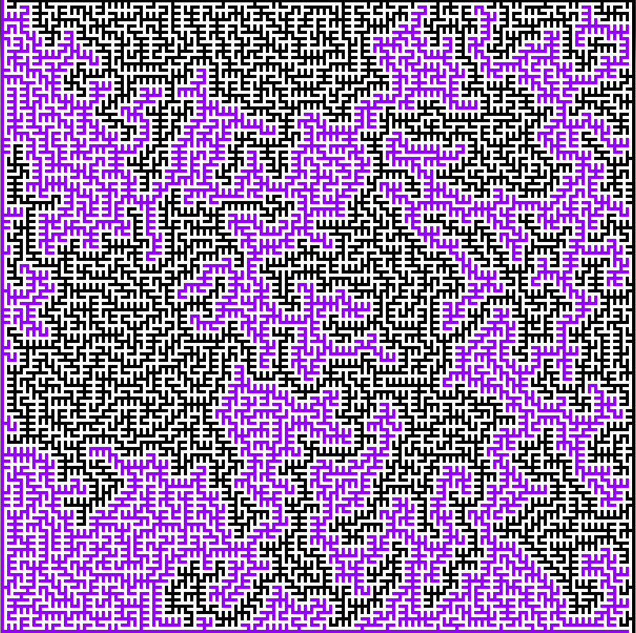
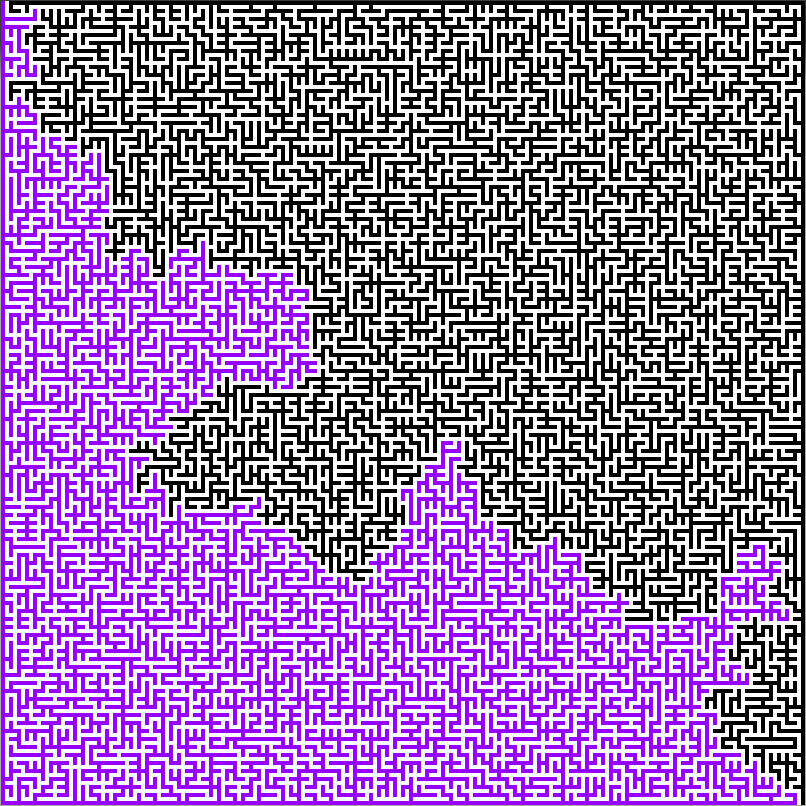

# KIV/KPG - Krásy počítačové grafiky

Sbírka semestrálních prácí.

## [1. Generování bludiště](maze)
* Dokumentace - [maze.pdf](maze/doc/maze.pdf)
* Implementace (java 6)
  * algoritmus Depth First Search - [MazeDFS.java](maze/MazeDFS.java)

  

  * Primův algoritmus - [MazePrim.java](maze/MazePrim.java)

  

## [2. Conway's game of life](life)
* Dokumentace - [life.pdf](life/doc/life.pdf)
* Implementace (java 6) - [Life.java](life/Life.java)

## [3. Animace fraktálu]
* Implementace (java 6) - [Fractal.java](julia/Fractal.java)
* Dokumentace - [zoom.pdf](julia/doc/zoom.pdf)

  

* Úprava rastrového obrazu

## Detaily kurzu
* Katedra informatiky a výpočetní techniky
* Fakulta Aplikovaných Věd - ZČU Plzeň (University of West Bohemia)
* Zimní semestr 2011
* Vyučující Prof. Dr. Ing. Ivana Kolingerová
