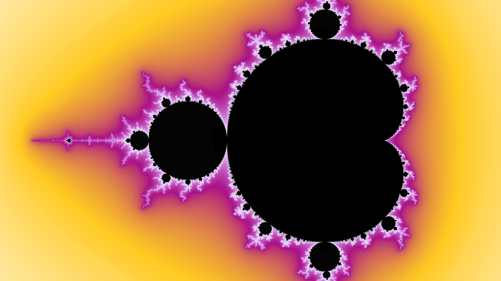
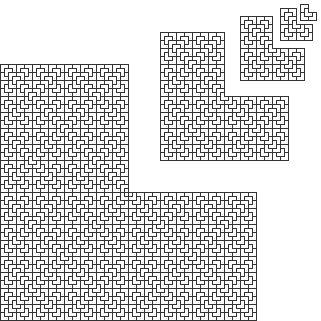

# KIV/KPG - Krásy počítačové grafiky

Sbírka semestrálních prácí.

## [1. Generování bludiště](maze)
* Dokumentace - [maze.pdf](maze/doc/maze.pdf)
* Implementace (java 6)
  * algoritmus Depth First Search - [MazeDFS.java](maze/MazeDFS.java)
  * Primův algoritmus - [MazePrim.java](maze/MazePrim.java)

   
   

## [2. Conway's game of life](life)
* Dokumentace - [life.pdf](life/doc/life.pdf)
* Implementace (java 6) - [Life.java](life/Life.java)

## [3. Animace fraktálu](julia)
* Dokumentace - [zoom.pdf](julia/doc/zoom.pdf)
* Implementace (java 6) - [Fractal.java](julia/Fractal.java)
* **Video na YouTube** - [**Mandelbrot set zoom - 720p**](https://www.youtube.com/watch?v=MbehWVq2oXY)
* Mandelbrot

  

## [4. Triomino](triomino)
* Dokumentace - [triomino.pdf](triomino/doc/triomino.pdf)
* Implementace (java 6) - [triomino/Main.java](triomino/Main.java)

  

## [5. Úprava rastrového obrazu](filtr)
* Dokumentace
* Implementace - C, GTK+ 3, Glade
 * [sharpen.c](filtr/sharpen.c)
 * [blur.c](filtr/blur.c)
 * [edge_detect.c](filtr/edge_detect.c)
 
### Doostření, Rozostření

  
  

### Detekce hran - Sobel, rozdíl Gaussovských rozostření, Laplacian of Sobel

  
  
  

## Detaily kurzu
* Katedra informatiky a výpočetní techniky
* Fakulta Aplikovaných Věd - ZČU Plzeň (University of West Bohemia)
* Zimní semestr 2011
* Vyučující Prof. Dr. Ing. Ivana Kolingerová
